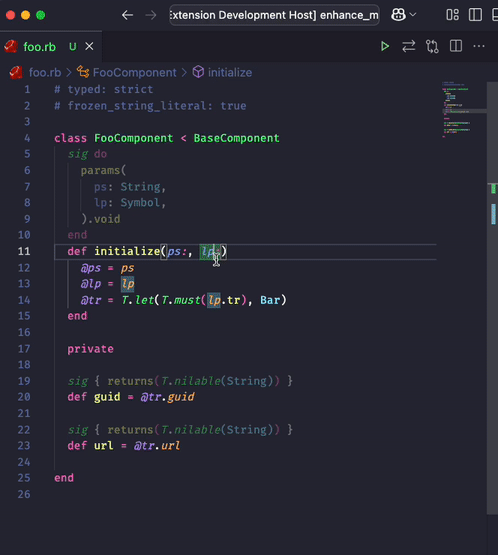

# RBS Snippets

Provides useful snippets for documenting your Ruby code with RBS.

Supports [inline RBS snippets for sorbet](https://railsatscale.com/2025-04-23-rbs-support-for-sorbet/).

## Features

Provides snippets for:

- Inline RBS (in sorbet)
- Class/Module definition
- instance variable definition
- instance/singleton method definition
- Interface definition
- getters and setters
- constant definition
- type aliases
- method aliases
- etc.

Commands:
- convert sorbet sigs to inline RBS comments
- convert sorbet type assertions to RBS comments

**Enjoy!**
